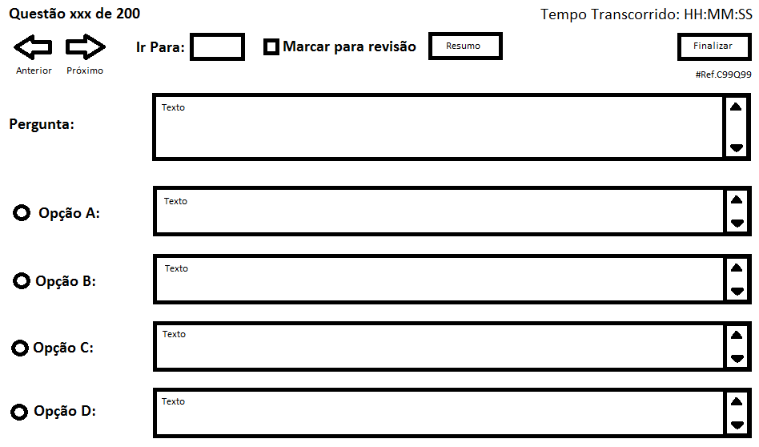
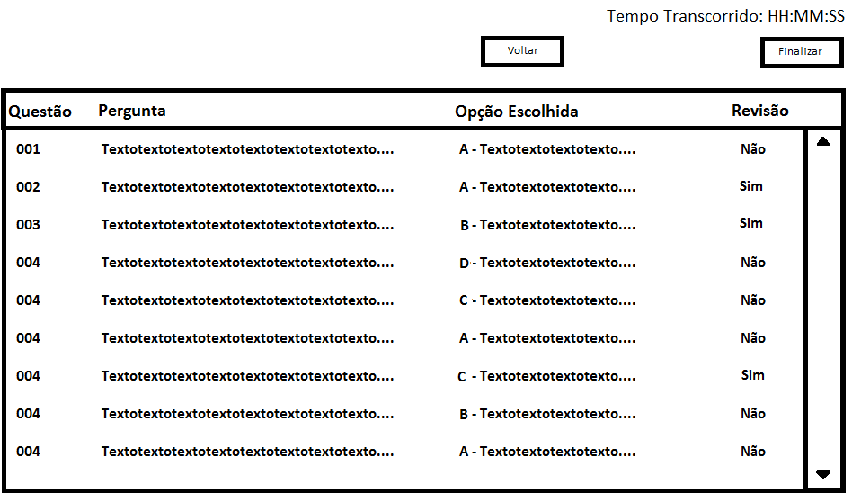

# Realização de Simulados

Documentação do projeto simulado conforme definido e deve ser utilizada para um melhor entendimento e posterior manutenção deste projeto.

## Detalhes Técnicos

Este projeto foi construído com os seguintes requisitos de software:
* Linguagem de Desenvolvimento: Java
* Banco de dados HSQLDB
* Biblioteca iText

## Detalhes de Instalação

Deve estar instalado o Java SE versão 1.8 ou superior.

O programa (simulado.jar) deve ser inserido em uma pasta sem acentos ou espaços em seu nome. Nesta pasta deve conter o banco de questões e uma pasta lib com os 
arquivos “hsqldb.jar” e “itextpdf-X.X.jar”

## Detalhes da Importação
Um arquivo em formato CSV (texto) delimitado por “«” será utilizado para importação, caso o primeiro carácter da linha seja um “%” esta será desprezada na importação.

A ordem dos campos é a seguinte:
```
Código«Questão«RespA«RespB«RespC«RespD«Certa«Área«Grupo
```

Como por exemplo:
```
C01Q01«Isto é teste«Sim«Não«Talvez«Depende«A«Conhecimentos Gerais«Teste
```

### Base de Dados

A estrutura do Banco de Dados é a seguinte:
```
Campo			Tipo		Conteúdo
identificacao	C99Q99	char(6)
pergunta		Texto		text
Opção A		Texto		text Opção A
Opção B		Texto		text Opção B
Opção C		Texto		text Opção C
Opção D		Texto		text Opção D
resposta		C		char(1)
area			Texto		text Área de Conhecimento
grupo			Texto		text Grupo dentro da Área
```

### Arquivo de configuração

Deve ser criado um arquivo chamado **opcao.sim** (formato texto) que contém os seguintes valores para o sistema:
* TEMPO=99999999 – Tempo total de prova
* TOTAL_QUESTAO=999 – Número de questões para a prova
* SIMULADO=99999999 – Código de segurança
* AC=area1;area2;... – Descrição das áreas de conhecimento separadas por “;”
* GP=grupo1;grupo2;... – Descrição dos grupos separados por “;”

# Requisitos de Tela

## Tela Inicial
 

O botão RESUMO é utilizado para o aluno acessar a Tela de Resumo. O botão FINALIZAR é utilizado para o aluno finalizar o simulado a qualquer momento, porém é necessário confirmar esta ação. Após a finalização do simulado a aplicação apresentará a Tela de Desempenho.

É apresentada a pergunta da questão e as opções de resposta “A”, “B”, “C” e “D”. Somente uma opção pode ser marcada por questão. É possível alterar a opção a qualquer momento antes do simulado ser finalizado. 

Quando o texto de um item da questão (pergunta ou opção) for muito grande, será necessário incluir barras de rolagem vertical para ter acesso a todo o conteúdo do texto. A tela possui o informativo do número da questão e o referencial da quantidade de questões presentes no simulado. A tela possui a informação de referência da questão.

## Tela de Resumo
Mostrar ao aluno o resumo do simulado, com os detalhes das questões, o texto truncado da pergunta, na opção escolhida se for o caso, o texto truncado da opção escolhida, do contrário mostrar um espaço no local, e se está marcada para revisão.

 

Ao pressionar o botão VOLTAR, o aluno retorna para a Tela Inicial na mesma questão onde se encontrava. Se o aluno clicar em uma questão da tela, retorna para a Tela Inicial, porém o registro atual passará a ser o registro escolhido, ou seja, os dados na tela são “links” para os registros das questões. A tela possui uma barra de rolagem vertical para mostrar as 200 questões do simulado. As regras do processo de finalização do simulado é similar as regras do processo da Tela Inicial.

## Tela de Desempenho
Esta tela é mostrada ao finalizar o simulado, apresentado o resumo do desempenho do aluno, conforme apresentado na tela (a tela já possui as informações de cálculo). As informações da área de conhecimento e por grupo de processo apresentarão somente os percentuais de acerto, conforme a seguinte fórmula: 
```
(QTD_Questões_Corretas / QTD_Questões_Grupo_Ou_Área) * 100
```
A quantidade de questões do grupo ou da área será obtida somando-se as informações de área de conhecimento e grupo de processo durante a importação do arquivo “questoes.csv” (ou algum outro formato tabulado).

 

Ao pressionar o botão SALVAR será gerado um arquivo com o nome “desempenho.pdf”. Esse arquivo será dividido em 2 (duas) partes:
1. Desempenho: As informações apresentadas na tela de desempenho.
2. Resumo das Questões: Conterá as seguintes informações:
  1. Referência da Questão: conforme a referência apresentada nas regras gerais.
  2. Opção Escolhida pelo Aluno: Pode ser “A”, “B”, “C” ou “D” ou ainda vazia “ “, caso o aluno não tenha respondido.
  3. Resultado: “Correta”, “Incorreta” ou “Não respondida”.

## Simulados Disponíveis

Disponibilizados os seguinte simulados:
* Java Fundamentos - Com os conceitos básicos de Java.
* OCWCD - Para a prova de Certificação Oracle Web Componnents Developer.
* PMP - Para a prova de Certificação PMP.
* Requisitos - Para a prova de Certificação de Requisitos.
